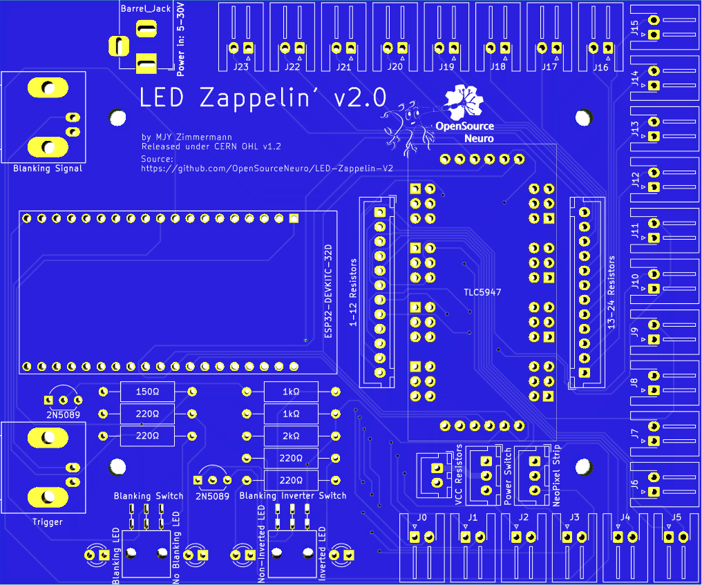
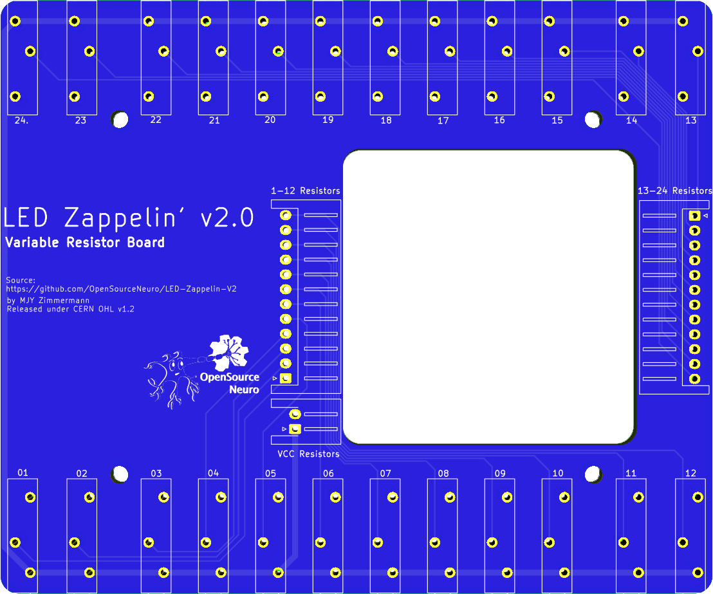
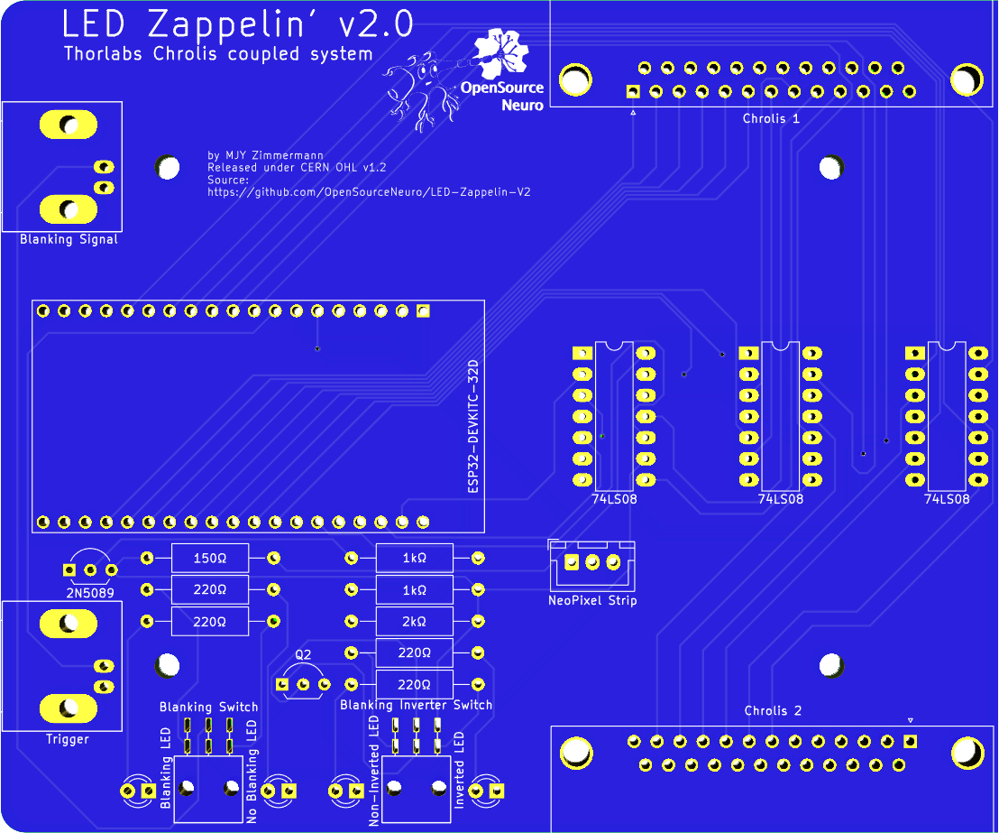

<h1 align="center"> Spikeling v2.2 - Assembly Manual</h1>

  

## Overview

This page contains detailed assembly instructions for both version of LEDF Zappelin', and includes a parts list for purchasing all electronics components.
Instructions on how to upload and update the microcontroller code and how to calibrate the device can be found <a href="https://github.com/OpenSourceNeuro/LED-Zappelin-V2/blob/main/Installation_Manual.md"> <strong>here</strong> </a>.
Instructions regarding the GUI and on how to design stimuli can be found <a href="https://github.com/OpenSourceNeuro/LED-Zappelin-V2/blob/main/GUI_UserManual.md"><strong>here</strong></a>

***

- [Ordering PCB](#Ordering-the-PCB)
- [Assembling LED Zappelin' - LED version](#Assembling-the-LED-version)
- [Assembling LED Zappelin' - Chrolis version](#Programming-the-ESP32)

***

## Ordering the PCB

First step consist in getting the stimulator board.
The PCB source files were designed on <a href="http://kicad.org/">KiCAD 6.0</a> and are available to be modified by users if need be.
They can be found on the GitHub repository <a href="https://github.com/OpenSourceNeuro/LED-Zappelin-V2/tree/main/PCB">PCB section</a>, where one can find the "Gerber" files that companies (i.e. <a href="https://jlcpcb.com">JLCPCB</a>) will request to manufacture PCBs.

For the LED version two boards are required, the <a href="https://github.com/OpenSourceNeuro/LED-Zappelin-V2/tree/main/PCB/LED-Zappelin-V2">main board</a> and the <a href="https://github.com/OpenSourceNeuro/LED-Zappelin-V2/tree/main/PCB/LED-Zappelin-V2-ResistorBoard">resistors board</a>.

For the Chrolis version, only the <a href="https://github.com/OpenSourceNeuro/LED-Zappelin-V2/tree/main/PCB/LED-Zappelin-V2-Chrolis"> main board</a> is required

 
 

## Assembling the LED version

Components can be sources from the <a href="">BoM</a> or <a href="">KitSpace</a>

The board itself is self-explanatory. There is no need to solder more JST pins nor trimmer resistors than the number of LED required for the desired stimulator.

The first switch on the left allows the user to enable the blanking function. When enabled, LED channels output will be blanked while receiving a "blanking" signal. The second switch allow the user to invert such blanking signal. For example, ScanImage users, will require such inversion.

 

The Adafruit TLC5947 LED driver is a constant current driver configured by default to set the current level at 15mA per channel, which is virtually safe for any LED. However, one can operate at different current by replacing the on-board reference resistor with a through hole resistor. The driver is capable to deliver up to 30mA, the graph shows the relationship between resistance and output current.

  

The stimulator casing can either be 3D printed (<a href="https://github.com/OpenSourceNeuro/LED-Zappelin-V2/tree/main/Casing%20Files/LED-Zappelin%20V2/STL">STL Files</a>) or laser cut (<a href="https://github.com/OpenSourceNeuro/LED-Zappelin-V2/tree/main/Casing%20Files/LED-Zappelin%20V2/DXF">DXF Files</a>)

The default casing is designed to hold a 2*8 neopixel stick that can be used as LED proxy for the user to check the ongoing status of the stimulation in the system.

 
 

## Assembling the Chrolis version

Components can be sources from the <a href="">BoM</a> or <a href="">KitSpace</a>

The assemly of this board is very similar to the previous one. the TLC LED driver is here replaced by a series of TTL logic AND gates which output to two D-SUB25 port to be connected with two chrolis systems.

The stimulator casing can either be 3D printed (<a href="https://github.com/OpenSourceNeuro/LED-Zappelin-V2/tree/main/Casing%20Files/LED-Zappelin%20V2%20-%20Chrolis/STL">STL Files</a>) or laser cut (<a href="https://github.com/OpenSourceNeuro/LED-Zappelin-V2/tree/main/Casing%20Files/LED-Zappelin%20V2%20-%20Chrolis/DXF">DXF Files</a>)

The default casing is designed to hold a 2*8 neopixel stick that can be used as LED proxy for the user to check the ongoing status of the stimulation in the system.
