

<h1 align="center"> LED Zappelin' v2.2 - GUI Instruction Manual</h1>

  

## Introduction
 

The following will detail how to control the stimulator, generate stimuli and modulate LED output.

From here we will assume that the stimulator is assembled (c.f. <a href="https://github.com/OpenSourceNeuro/LED-Zappelin-V2/blob/main/Assembly_Manual.md"> Assembly manual </a>), that drivers were installed, that an adapted power supply was selected to supply the LED driver and that all LEDs were calibrated and that their maximum intensity values were hardcoded on the microcontroller firmware (c.f. <a href="https://github.com/OpenSourceNeuro/LED-Zappelin-V2/blob/main/Installation_Manual.md"> Installation manual </a>).

The GUI (Graphical User Interface) is developed on the python libraries PyQt6/PySide6. The code is open and can be consulted and modified <a href="https://github.com/OpenSourceNeuro/LED-Zappelin-V2/tree/main/GUI">here</a>. The GUI can be run on a python virtual environment with the required libraries.

However, for convenience, an <strong>.exe</strong> file has been generated from the above code and can be found <a href="https://github.com/OpenSourceNeuro/LED-Zappelin-V2/tree"> here</a>

  

## Home page
 

From the main page, all software can be accessed:
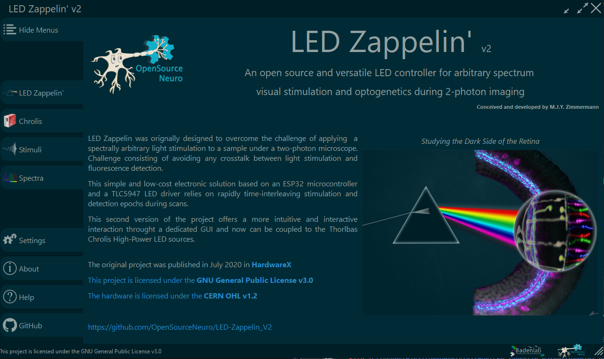
***
- [LED Zappelin - Custom LEDs](#Custom%20LEDs)
- [LED Zappelin - Chrolis](#Chrolis)
- [Stimuli Generator](#Stimuli%20Generator)
- [Spectra](#Spectra)
***
- [Settings](#Settings)
- [About](#About)
- [Help](#Help)
- [GitHub](#GitHub)
***
  

## Custom LEDs 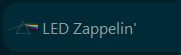
  

This section of the GUI corresponds to the <strong>24 custom LEDs</strong> version of the stimulator where users can select their own stimulating LEDs. For the proxy LEDs on the front panel of the stimulator to match the order and "colours" of the stimulating LEDs, users need to update the Arduino code on the board as described in the <a href="https://github.com/OpenSourceNeuro/LED-Zappelin-V2/blob/main/Installation_Manual.md">Installation_Manual</a>.

 

#### Connecting the software
 

The GUI exchanges with the stimulator through a serial communication via a micro USB cable connected on the left side of the stimulator. First, users need to establish a serial connection with the board by selecting a <strong>COM port</strong>. If the proper COM port is selected, the proxy LEDs should light up. Next, just click on the <strong> Connect LED Zappelin'</strong> button.

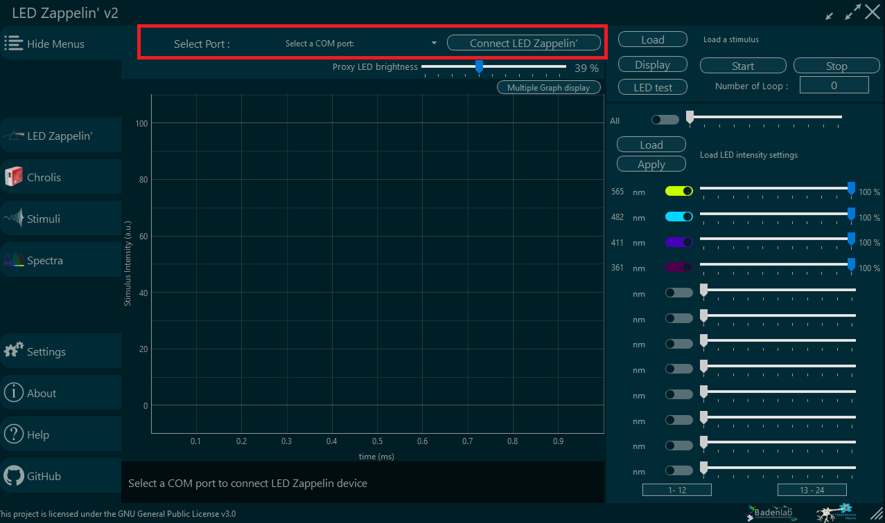

 

#### Set LED
 

On the right-hand side of the window, users can individually control each LED maximum intensity output by adjusting the slider or manually enter a integer number on the right end of the slider, or turn if off completely by toggling the left coloured button.

This value linearly sets the new maximum intensity at which an LED would be played. A proper LED calibration (c.f. <a href="https://github.com/OpenSourceNeuro/LED-Zappelin-V2/blob/main/Installation_Manual.md"> Installation manual </a>), will ensure that the new maximum settings will accurately correspond to the slider percentage of the max calibrated value.

The top white slider above allows the user to control all LED channel at once.

For display purposes, toggle button colours correspond to the LED wavelength selected by the users and can be manually set by entering the appropriate wavelength on the left side of the slider. When a new wavelength is entered, the corresponding proxy LED will match its colour to the new wavelength value.

It is possible to select a pre-selected array of LED values and wavelength by loading a <strong>.csv</strong> file. To do so, just aove the LED sliding bars, press the <strong>Load</strong> button, select the appropriate file then click <strong>Apply</strong>.

The <strong>.csv</strong> file should be composed as follow:
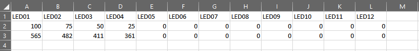

The header line should not be changed

The first row corresponds to the light intensities in percentage. Only integer should be entered Here

The second row corresponds to the LED wavelength, entered here only for display purpose.

In the above example, only the first four LED channels are activated:
- LED #01 at 100% corresponding to 565nm
- LED #02 at 75% corresponding to 482nm
- LED #03 at 50% corresponding to 411nm
- LED #04 at 25% corresponding to 361nm

The <strong>.csv</strong> file should conveniently be placed in the <strong>LED_Settings</strong> folder where the <strong>.exe</strong> file is located.

Users can also check their LED status by clicking on the <strong>LED test</strong> button. This will activate the stimulating LEDs and their respective proxy LEDs according to the slider positions.

Furthermore, depending on the user light environment, the proxy LEDs might be too bright or too dim. Their brightness can then be adjusted by modulating the <strong>Proxy LED brightness</strong> slider on top of the screen. Placing this slider all the way down will just turn off the proxy LEDs. This will, obviously, only affect the proxy LEDs, not the LED ouput channels.

  

#### Loading a stimulus
 

Stimuli are generated as dataframes in a <strong>.csv</strong> format (c.f. [Stimuli Generator](#Stimuli%20Generator))

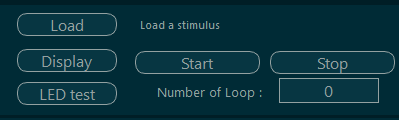

The top right part of the screen is the stimulus panel. Here users can load, check and play the stimulus.
By clicking the <strong>Load</strong> button, users can select their pre-generated stimulation sequence, ideally from the <strong> Stimuli</strong> folder located alongside the <strong>.exe</strong> file. The stimulus file name will then be displayed on the panel for user appreciation.

In order to check the stimulation sequence, user can plot the sequence by clicking the <strong>Display</strong> button.
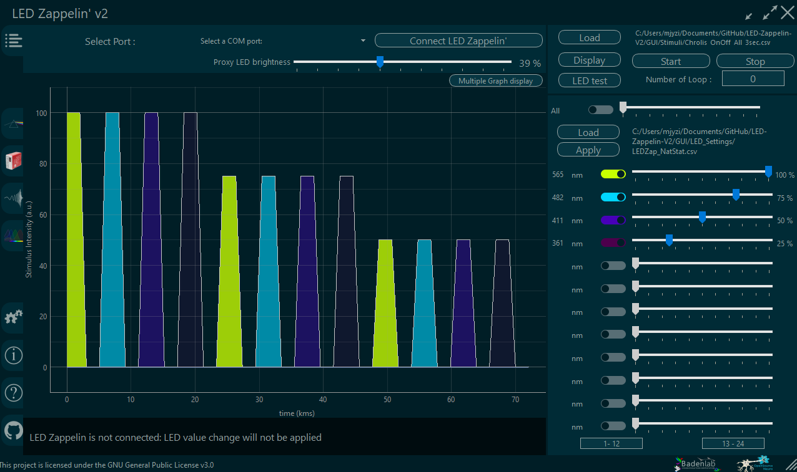

The sequences for all activated LEDs are then displayed on the graph, their translucence corresponding to the LED intensity slider levels.

On this graph is only displayed the stimulation sequence that will be looped, the potential pre-stimulation being not displayed here (c.f. [Stimuli Generator](#Stimuli%20Generator)).

In order to check all LED sequences individually, users can click on the <strong> Multiple Graph display</strong> button above the graph.
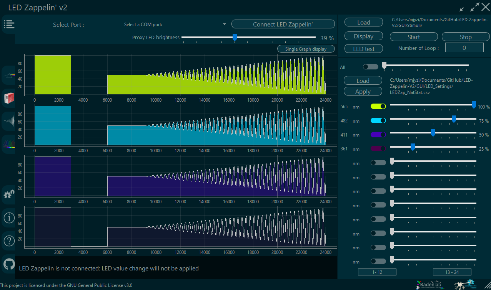

They can also zoom in each graph, i.e. to check specific alignment in the overall sequence.

Then return to the overlapping graph by clicking on the new <strong>Single Graph display</strong> button.

  

#### Playing a stimulus
 

Once "loaded", a stimulus is ready to be played.

The LED sliders set the maximum intensities in percentage of the maximum calibrated value, then the stimulation sequence will operate within this range.

Users can here select the <strong>Number of Loops</strong> they need to be played. A value of 0 (by default) will see the stimulus sequence being played until the user manually stops it. Any higher integer value entered, will only play the stimulus this amount of times.

Upon clicking on the <strong>Start</strong> button, the stimulator will first play, and only once, the pre-stimulation as entered in the stimuli <strong>.csv</strong> file (c.f. [Stimuli Generator](#Stimuli%20Generator)), then play the stimulation sequence in loops. If the restimulation time is 0, then the stimulation sequence will start readily and the monitor at the bottom of the screen will displayed the current loop number being played.

When clicked, the <strong>Start</strong> button will light up in red.
Clicking the <strong>Stop</strong> button will stop the stimulation sequence and return the stimulation settings to its ready conditions.

  

***
 

## Chrolis 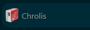
  

Mostly identical to the 24 custom LED

<strong>To Be Completed</strong>

  
***

## Stimuli Generator 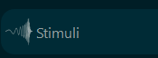
  

A stimuli generator tab can be found on the GUI and allows users to generate simple stimuli on the fly.

However, we recommend users to generate their own stimuli using whatever programming language they prefer.

Here we provided <a href="https://github.com/OpenSourceNeuro/LED-Zappelin-V2/tree/main/Notebooks">python jupyter notebook</a> with visualisation graph to generate the most common stimuli in our field. These notebooks can be easily modify to generate any sequence users might need.

The only thing that matters, no matter the programming language chosen, is to export the stimulation sequence as a <strong>.csv</strong> dataframe, just as follow:

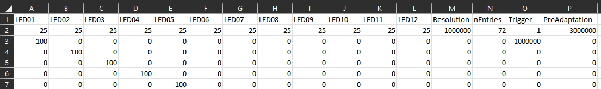
 

LED values are expressed in percentage, and the time values are expressed in micro-seconds.

The header line labels need to be respected in order to be read properly by the software.

Let's only consider the 12 first columns (columns A to L) (or less or more depending on your stimulator version): these columns corresponds to the sequential values (in percentage of the max set intensities) that will be output for each LED channels.

The first row (line 2) only concerns the pre-stimulation (pre-adaptation) period that is only going to be played once, at the very start of the stimulation and for a period of time indicate in the first row of the <strong>Pre-Adaptation</strong> column (P2) in microseconds. A value of 0 will simply skip the pre-adaptation. The other row values will be ignored

The sequence then starts on the second row (row 3) and will/could be looped back to this point when the sequence is over.

The first row of the <strong> Resolution</strong> column (M2) indicates the amount of time each row value will be played in microseconds. The other row values will be ignored.

For the GUI to keep track of the stimulation sequence, the number of value entries (without the pre-adaptation) needs to be entered on the first row of <strong> nEntries</strong> (N2). The other row values will be ignored.

The <strong>Trigger</strong> column sets the trigger output from the stimulator in the form of a 3.3V pulse with a duration by default of 100 000 microseconds which can be modified on the Arduino code>General_Settings.h>TriggerDuration (Do not forget to reupload the code on the board afterwards).

The first row (O2) sets the trigger mode:

- A <strong>"n = 0"</strong>  value will only play a trigger once, when the stimulation starts (and after an eventual pre-adaptation).

- A value of <strong>"n = 1"</strong>  will play a Trigger in a repeated fashion, starting at the beginning of the stimulation sequence (and after an eventual pre-adaptation), and will occur every x microseconds. x being the value entered in the row below (O3). It is encouraged in this mode to generate stimuli that will end at a multiple of x in order to properly align the stimulation and recording session during the data pre-analysis.

- A value <strong>"n = >1"</strong> will output n different triggers with inter-trigger length equal to the value O(2+i) (for i within n). In this mode, it is encouraged that the sum of all inter-trigger length matches the length of the entire stimulation sequence, once again for alignment purposes.

 

Overall, the stimulus presented above can be read as follow:
- The sequence is made of 72 points, each lasting 1 seconds (1 000 000 microseconds)
- A pre-adaptation of 3 seconds (3 000 000 microseconds) will be played only once at the begining of the stimulation with all 12 LEDs on at 25% of their max set intensities (set calibration eventually linearly tuned down by LED sliders).
- During the stimulation, a trigger will be produced every second (1 000 000 microseconds).
- The beginning of the stimulation apparently consists of a sequential activation(on/off) in order of the first 5 LEDS (for 1 sec (resolution value))
  
***

## Spectra 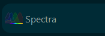
  
<strong>To Be Completed</strong>
  
***

## Settings 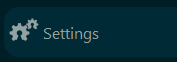
  
<strong>To Be Completed</strong>
  
***

## About 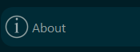
  
<strong>To Be Completed</strong>
  
***

## Help 
  
<strong>To Be Completed</strong>
  
***

## GitHub 
  
<strong>To Be Completed</strong>
  
***
