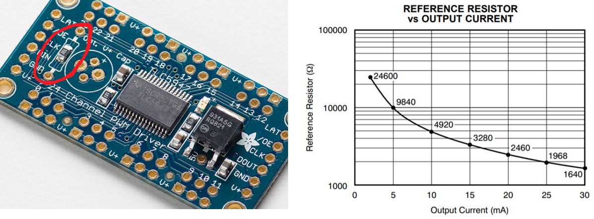
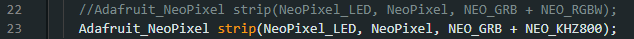
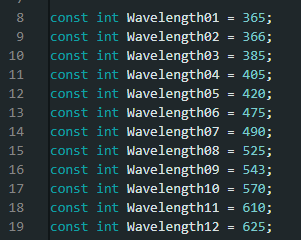
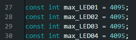

<h1 align="center"> LED Zappelin' v2.2 - Installation Manual</h1>

  

## Hardware
 

On the stimulator board, LEDs are controlled by the <a href="https://www.adafruit.com/product/1429">  TLC5947</a> LED driver. This is a constant current driver, which is exactly what it is required for precise LED intensity control.

A constant current driver gives some flexibility with the supply voltage and dismiss the need to use current limiting resistors. Stimulating LEDs can then be connected directly to the LED output on the device.

The TLC5947 driver will adjust automatically to any power supply fluctuation, preventing LED to flicker, increasing their life-spam and maintaining their efficiency over time, hence reducing maintenance calibration or replacement.

The board on the stimulator is set by default to deliver 15mA per LED channel, which is safe to virtually all LEDs that can be purchased on the market. However it is possible to operate the LED channels at different currents by replacing the on-board reference resistor with a through-hole resistor. The maximum current level at which the TLC5947 driver can operate being 30mA per channel

The location of the through-hole resistor is circled in red and the following graph shows the relationship between the resistance and the driver output current. If the user wants / needs to change the current output, the LED datasheet will provide the optimal forward current required. Still it is not expected that such current change would be necessary.

The TLC driver is powered separately from the microcontroller, from the back of the device and can take 5v to 30V. Since the TLC is a constant current driver, the voltage selection is not really critical. It just needs to be slightly higher than the LEDs forward voltage (typically around 3v for standard LEDs). In doubt consult the LED datasheet

  

## Driver Installation
 

LED Zappelin runs on an Espressif ESP32 board and requires the USB to UART bridge <a href="https://www.silabs.com/developers/usb-to-uart-bridge-vcp-drivers"> CP210x driver</a>,  which can be downloaded<a href="https://www.silabs.com/developers/usb-to-uart-bridge-vcp-drivers?tab=downloads"> <strong>here</strong></a>.

Once the driver has been installed, users can operated the GUI (c.f. <a href="https://github.com/OpenSourceNeuro/LED-Zappelin-V2/blob/main/GUI_UserManual.md"> GUI UserManual</a>) or modify the <a href="https://github.com/OpenSourceNeuro/LED-Zappelin-V2/tree/main/Arduino">microcontroller code</a> through the Arduino Integrated Development Environment (IDE).

  

## Microcontroller Arduino code

 

##### Arduino IDE

 

The ESP32 microcontroller runs a C++ code which can be accessed via the Arduino IDE, which can be downloaded <a href="https://www.arduino.cc/en/software">here</a>.

 

##### ESP32 Add-on

 

Once the IDE is installed, users needs to install the ESP32 board library:

In the Arduino IDE, go to <strong> File > Preferences </strong>

Enter the following link into the <strong>Additional Board Manager URLs</strong> field:

https://raw.githubusercontent.com/espressif/arduino-esp32/gh-pages/package_esp32_index.json

Then click on the <strong>OK</strong> button.

  

Next, open the Boards Manager. Go to <strong> Tools > Board > Board Manager...</strong>

Search for ESP32 and press install button for the <strong>ESP32 by Espressif Systems</strong>.

Then click on the <strong>Install</strong> button.

  

##### Compiling the code

 

Within the Arduino IDE, user needs to select the FQBN (Fully Qualified Board Name) on which the code will be compiled for.

Here the ESP32 Dev Module needs to be selected.

Go to <strong>Tools > Board > esp32 > ESP32 Dev Module </strong>

The board name should be displayed  as shown.

  

Before compiling the LED Zappelin code, a few librairies need to be installed:
  - Arduino-SerialCommand
  - Adafruit_TLC5947
  - Adafruit_NeoPixel

Most of them can be downloaded from the Arduino IDE: Go to <strong>Sketch > Include Librairy > Manage Libraries</strong>, enter the library name, then install it following the same process as for the board library.

We however recommend for the Arduino-SerialCommand library to manually place the library folder which can be found <a href="https://github.com/OpenSourceNeuro/LED-Zappelin-V2/tree/main/Arduino/Librairies">here</a> into the library folder. For Windows Users: <strong>C:/Users/x/Documents/Arduino/libraries</strong>

Now everything is set to compile and verify the code.

Users can now select the COM port on which the ESP32 is connected ( Go to <strong>Tools > port</strong> ) and upload the code onto the board.

  

##### Code and calibration

 

The code runs continuously on the board in a loop detailed in the main tab (LED_Zappelin_V2.ino).
To not interfere with the proper function and communication of the program, avoid modifying this part of the code.

 

In <strong>General_Settings.h</strong>:

- There exists two versions for the NeoPixel strips that serve as proxy LEDs for the device. If the proxy LEDs do not display the appropriate colours, comment/uncomment the Adafruit_NeoPixel functions:

 

In <strong> LED_Values.h </strong>

- Users can select here the colours displayed by the proxy LEDs by entering the wavelength corresponding to each stimulating LEDs.

- The TLC5947 is a linear current-sink LED driver with a 12bits resolution (4096 values).
However, some LEDs may reach their maximum intensities before reaching the maximum stimulating value (4095). A calibration step is then require here.

    Trimmer potentiometers corresponding to each LED channels can be found on the device. They regulate the maximum current intensity each stimulating LED can be drove with.

    First, user need to set each stimulating LED to their desired maximum intensity by adjusting the potentiometer value.

    Once done, play a <a href="">step-increased stimulation sequence</a> for the tested LED and not at which value the LED maximum intensity is reached and (may?) plateau.

    Finally enter the noted value in the <strong> LED_Values.h</strong> tab.
    

      

    Reupload the code onto the board, now the tested LED will have a linear intensity increase from 0 to 100% without any saturation.

  

No further modification of the code is then required from the user who can now control the board directly from the GUI.
