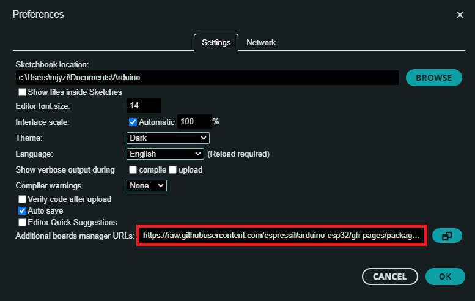
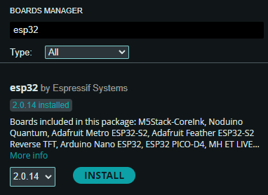

<h1 align="center"> Spikeling v2.2 - Installation Manual</h1>

  

## Driver Installation

LED Zappelin runs on an Espressif ESP32 board and requires the USB to UART bridge <a href="https://www.silabs.com/developers/usb-to-uart-bridge-vcp-drivers"> CP210x driver</a>,  which can be downloaded<a href="https://www.silabs.com/developers/usb-to-uart-bridge-vcp-drivers?tab=downloads"> <strong>here</strong></a>.

Once the driver has been installed, users can operated the GUI (c.f. <a href="https://github.com/OpenSourceNeuro/LED-Zappelin-V2/blob/main/GUI_UserManual.md"> GUI UserManual</a>) or modify the <a href="https://github.com/OpenSourceNeuro/LED-Zappelin-V2/tree/main/Arduino">microcontroller code</a> through the Arduino Integrated Development Environment (IDE).

  

## Microcontroller Arduino code

##### Arduino IDE
The ESP32 microcontroller runs a C++ code which can be accessed via the Arduino IDE, which can be downloaded <a href="https://www.arduino.cc/en/software">here</a>.

 

##### ESP32 Add-on

Once the IDE is installed, users needs to install the ESP32 board library:

In the Arduino IDE, go to <strong> File > Preferences </strong>

Enter the following link into the <strong>Additional Board Manager URLs</strong> field:

https://raw.githubusercontent.com/espressif/arduino-esp32/gh-pages/package_esp32_index.json

Then click on the <strong>OK</strong> button.

  

Next, open the Boards Manager. Go to <strong> Tools > Board > Board Manager...</strong>

Search for ESP32 and press install button for the <strong>ESP32 by Espressif Systems</strong>.

Then click on the <strong>Install</strong> button.

  
##### Compiling the code

Within the Arduino IDE, user needs to select the FQBN (Fully Qualifief Board Name) on which the code will be compiled for.

Here the ESP32 Dev Module needs to be selected.

Go to <strong>Tools > Board > esp32 > ESP32 Dev Module </strong>

The board name should be displayed  as shown.

  

Before compiling the LED Zappelin code, a few librairies need to be installed:
  - Arduino-SerialCommand
  -
  Most of them can be downloaded
