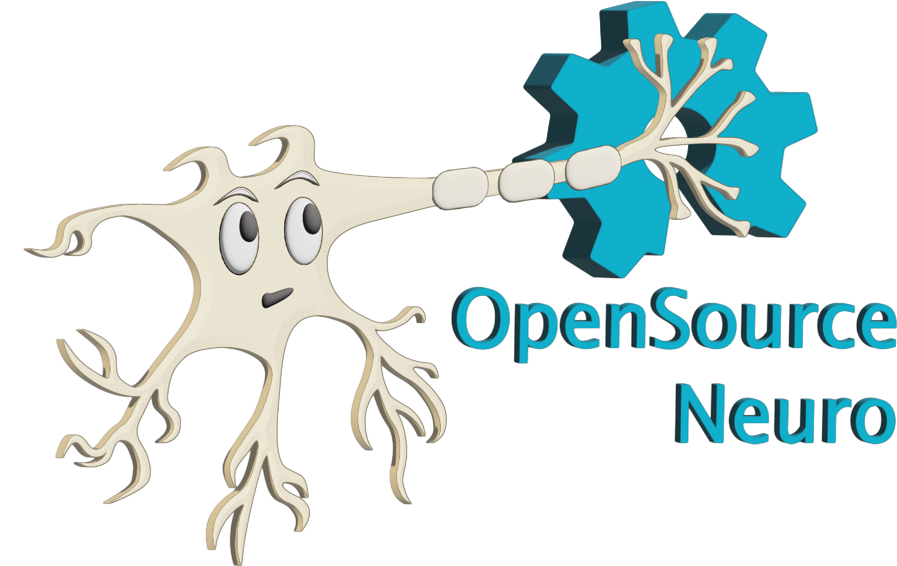
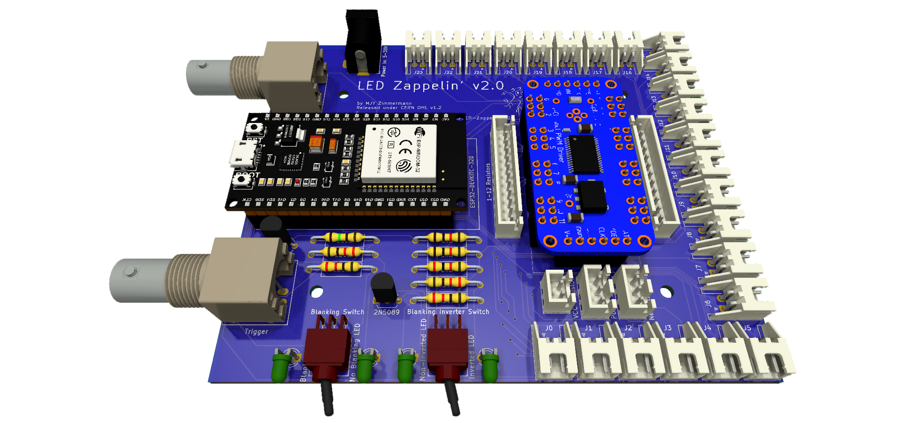
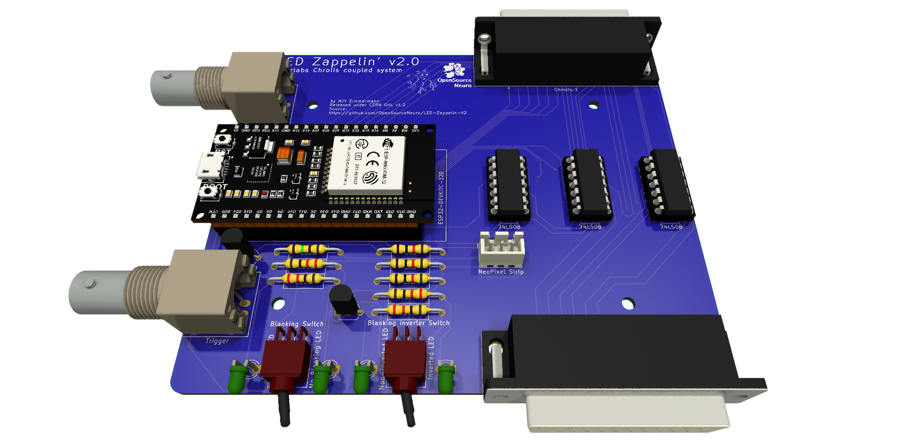

<h1 align="center"> LED Zappelin' v2</h1>
<h3 align="center">  An Open Source and versatile LED controller for arbitrary spectrum visual stimulation and optogenetics during two-photon imaging.</h3>

<h6 align="right">developed by M.J.Y. Zimmermann, A.M. Chagas & T. Baden</h6>

 

This project is licensed under the <a href="https://www.gnu.org/licenses/gpl-3.0.html">GNU General Public License v3.0</a>
 
The hardware is licensed under the <a href="https://cern-ohl.web.cern.ch">CERN OHL v1.2</a>

***

Two-photon microscopy is a cornerstone technique in neuroscience research, but combining this technology with spectrally arbitrary light stimulation can be challenging due to crosstalk between stimulation light and fluorescence detection. To overcome this limitation, we present LED Zappelin': a simple and low-cost electronic solution to rapidly time-interleave stimulation and detection epochs during scans.

The second version of this project allows user to either:

  - Independently drive up to 24 arbitrary spectrum LEDs to meet user requirements. Using the <a href="https://www.ti.com/lit/ds/symlink/tlc5947.pdf">TLC5947 LED driver</a>.
  - Control external light source generator such as the <a href="https://www.thorlabs.com/newgrouppage9.cfm?objectgroup_id=13597">Thorlabs Chrolis</a>. Using TTL logic circuits.

 

  

  
  
  

  <h5 align="justify"> <em>Left: </em>LED Zappelin' mounted with a TLC 5947 controlling up to 24 LED channels. <em>Right: </em>LED Zappelin' mounted with TTL circuit controlling two 6-High_Power LED Chrolis systems</h5>

In the <a href=https://pubmed.ncbi.nlm.nih.gov/35498254/>original publication</a>, we demonstrate the utility of our stimulator for colour vision experiments on the in vivo tetrachromatic zebrafish retina and for optogenetic circuit mapping in Drosophila.

 

- [An open and versatile LED controller](#Introduction)
- [A £100 DIY efficient stimulator](https://github.com/BadenLab/LED-Zappelin/blob/master/Bills%20of%20Materials/BOM%20-%20Stimulator.csv)
- [A stimulator for visual neuroscience](#Colour-Vision-Experiment)
- [A stimulator for optogenetics](#Optogenetics-Experiment)
- [A detailed assembly and instruction manual](https://github.com/BadenLab/LED-Zappelin/blob/master/Instruction%20Manual/README.md)
- [A step by step calibration script](https://github.com/BadenLab/LED-Zappelin/blob/master/Instruction%20Manual/Stimulator%20Calibration/Stimulator_Calibration.ipynb)
- [Repository Structure](#Repository-Structure)

 

## Introduction

Combining two-photon imaging with additional light stimulation – for example for visual stimulation or for driving optogenetic actuators – has remained challenging because the stimulation light can interfere with fluorescence detection. This can result in light artefacts in the image and/or may damage sensitive fluorescence detection equipment (e.g. photomultiplier tubes, PMTs).

A temporal separation between light stimulation and fluorescence detection, for example during the scan-retrace, can ameliorate these problems.
This problem can be readily solved electronically, for example through use of a microcontroller.

Here, we present such a solution. Our system can either line-synch up to 24 independent LED channels or can be connected to external commercial light sources, and can be assembled from off-the-shelf components for substantially below $200. This provides for flexible options of spectrally diverse light stimulation during two-photon scanning and comfortably provides sufficient power to drive standard optogenetics actuators such as CsChrimson.

Alongside, we also provided <a href="https://github.com/OpenSourceNeuro/LED-Zappelin-V2/tree/main/Casing%20Files">custom casing files</a> (for either 3d print or laser-cut), <a href="https://github.com/OpenSourceNeuro/LED-Zappelin-V2/tree/main/3D%20files">designed suggestions</a> for optically combining LED banks using Thorlabs parts, and an alternative 3D-printed LED holder and microscope chamber.

The device is built around an <a href="https://www.espressif.com/en/products/socs/esp32">ESP32</a>, a microcontroller which exchange signals with the recording setup, drive the light sources and runs on C++. However, users do not need to interfere with the source code as we provide an intuitive and interactive <a href="">Graphical User Interface</a> (GUI), from which all functions and variables can be manipulated.

<a href="https://github.com/OpenSourceNeuro/LED-Zappelin-V2/blob/main/GUI_UserManual.md">Here</a>, is the full user guide documentation.

***

The stimulator runs synchronous to the recording system using TTL triggers. TTL signals correspond to scanning mirror retrace periods and are used to turn ON and OFF LEDs, thus avoiding swamping the PMTs by stimulation light.

On the PCB, we incorporated a signal inverter which can be enabled through a jumper (see below) and that can modulated the TTL signal sign. This customisable option thus offers the possibility for a single design to be easily adapted to multiple imaging systems.

<h5 align="justify"> a) Oscilloscope reading of the blanking signal (blue) efficiently switching off an LED (yellow). The blanking is operated here without noticeable delay. b) Same as a), showing for a 1ms scanning cycle, the two possible configurations for the blanking signal input, with a low (top) and a high (bottom) blanking signal input respectively for an inverted and original signal input. </h5>

***

 The use of a dedicated constant current LED driver tends to improve LED stability over time as well as its life span. Such driver ensures that the current drawn by the LED never leads to thermal runaways that might cause irreversible damage. This is particularly essential for short wavelength LEDs which tend to rapidly decay, thus necessitating regular recalibration or replacement. 

<h5 align="justify">  a) Power recording of a 4 LED system using the TLC5947 (solid lines) and their expected brightness if directly controlled by a microcontroller (dashed lines). All LEDs have been set up to the same power (40nW), with equal max intensities values in the Arduino code. b) Same as a) but with LEDs set up at different max intensities in the Arduino code. Here the linearity of the LED intensity output remains constant. </5>

***
=======
# LED-Zappelin-V2
>>>>>>> 1892e51c7560366fad7b1b9efeeaa54bd3a136fd
