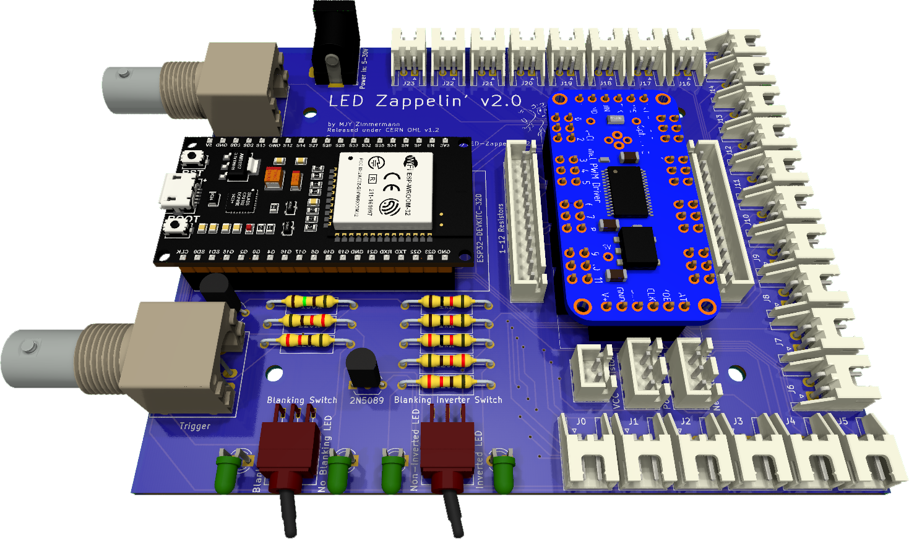
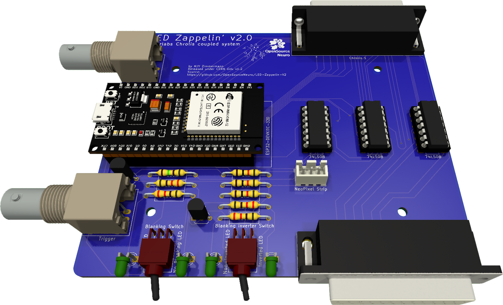

<p align="left">

</p>

<h1 align="center"> LED Zappelin' v2</h1>
<h3 align="center">  An Open Source and versatile LED controller for arbitrary spectrum visual stimulation and optogenetics during two-photon imaging.</h3></p>
<h6 align="right">developed by M.J.Y. Zimmermann, A.M. Chagas & T. Baden</h6>

<br>

This project is licensed under the <a href="https://www.gnu.org/licenses/gpl-3.0.html">GNU General Public License v3.0</a>
<br>
The hardware is licensed under the <a href="https://cern-ohl.web.cern.ch">CERN OHL v1.2</a>


***

<p style='text-align: justify;'>
Two-photon microscopy is a cornerstone technique in neuroscience research, but combining this technology with spectrally arbitrary light stimulation can be challenging due to crosstalk between stimulation light and fluorescence detection. To overcome this limitation, we present LED Zappelin': a simple and low-cost electronic solution to rapidly time-interleave stimulation and detection epochs during scans.
</p>

The second version of this project allows user to either:

  - Independently drive up to 24 arbitrary spectrum LEDs to meet user requirements. Using the <a href="https://www.ti.com/lit/ds/symlink/tlc5947.pdf">TLC5947 LED driver</a>.
  - Control external light source generator such as the <a href="https://www.thorlabs.com/newgrouppage9.cfm?objectgroup_id=13597">Thorlabs Chrolis</a>. Using TTL logic circuits.

</br>

<p align="center">


</p>

<h5 align="justify"> <em>Left: </em>LED Zappelin' mounted with a TLC 5947 controlling up to 24 LED channels. <em>Right: </em>LED Zappelin' mounted with TTL circuit controlling two 6-High_Power LED Chrolis systems</h5>

<br></br>

<p style='text-align: justify;'>
In the <a href=https://pubmed.ncbi.nlm.nih.gov/35498254/>original publication</a>, we demonstrate the utility of our stimulator for colour vision experiments on the in vivo tetrachromatic zebrafish retina and for optogenetic circuit mapping in Drosophila.
</p>


<br>


- [Introduction](#Introduction)
- [BoM](https://github.com/BadenLab/LED-Zappelin/blob/master/Bills%20of%20Materials/BOM%20-%20Stimulator.csv)
- [Request a Quote]()
- [A stimulator for visual neuroscience](#Colour-Vision-Experiment)
- [A stimulator for optogenetics](#Optogenetics-Experiment)
- [A detailed assembly and instruction manual](https://github.com/BadenLab/LED-Zappelin/blob/master/Instruction%20Manual/README.md)
- [A step by step calibration script](https://github.com/BadenLab/LED-Zappelin/blob/master/Instruction%20Manual/Stimulator%20Calibration/Stimulator_Calibration.ipynb)
- [Repository Structure](#Repository-Structure)

<br>

## Introduction

<p align="justify">
Combining two-photon imaging with additional light stimulation – for example for visual stimulation or for driving optogenetic actuators – has remained challenging because the stimulation light can interfere with fluorescence detection. This can result in light artefacts in the image and/or may damage sensitive fluorescence detection equipment (e.g. photomultiplier tubes, PMTs).
</p>

<p align="justify">


A temporal separation between light stimulation and fluorescence detection, for example during the scan-retrace, can ameliorate these problems.
This problem can be readily solved electronically, for example through use of a microcontroller.
</p>

<br>

<p align="justify">
Here, we present such a solution. Our system can either line-synch up to 24 independent LED channels or can be connected to external commercial light sources, and can be assembled from off-the-shelf components for substantially below $200. This provides for flexible options of spectrally diverse light stimulation during two-photon scanning and comfortably provides sufficient power to drive standard optogenetics actuators such as CsChrimson.
</p>

<br>

<p align="justify">
Alongside, we also provided <a href="https://github.com/OpenSourceNeuro/LED-Zappelin-V2/tree/main/Casing%20Files">custom casing files</a> (for either 3d print or laser-cut), <a href="https://github.com/OpenSourceNeuro/LED-Zappelin-V2/tree/main/3D%20files">designed suggestions</a> for optically combining LED banks using Thorlabs parts, and an alternative 3D-printed LED holder and microscope chamber.
</p>

<p align="justify">
The device is built around an <a href="https://www.espressif.com/en/products/socs/esp32">ESP32</a>, a microcontroller which exchange signals with the recording setup, drive the light sources and runs on C++. However, users do not need to interfere with the source code as we provide an intuitive and interactive <a href="">Graphical User Interface</a> (GUI), from which all functions and variables can be manipulated.
</p>

</br>

<p align="center">


</p>

<h5 align="justify"> <em>Left: </em>LED Zappelin' GUI controlling 4 LEDs, all executing a chirp stimulus. <em>Right: </em>LED Zappelin' controlling 12 LED channels from two Chrolis systems, executing successive On/Off stimulati</h5>

<br></br>

<p align="justify">
<a href="https://github.com/OpenSourceNeuro/LED-Zappelin-V2/blob/main/GUI_UserManual.md">Here</a>, is the full user guide documentation.
</p>

<br>

***

## Colour Vision Experiment


[](https://youtu.be/FhLoFGbbpPo)

<p align="justify">
We used LED Zappelin' for studying the retinal processing of the tetra-chromatic zebrafish retina in response to multichromatic signal.
Here we selected four LEDs that match the peak sensitivities of each cone opsins of our model.
We chose LEDs and band pass filters in such manner that the stimulating light and the detection bands do not overlap as much as possible. However a temporal separation is still necessary to avoid some overlapping and any light artefact.
</p>


</br>

<p align="center">


</p>

<h5 align="justify"> <em>Left: </em>Zebrafish's opsin absorbance spectra overlapped with four filtered LED spectra. <em>Right: </em>The four selected stimulation LEDs along the microscope setup spectra features</h5>

<br></br>

 We recorded light-driven calcium signals under 2-photon from [retinal bipolar cells in vivo in the tetrachromatic larval zebrafish](https://github.com/BadenLab/LED-Zappelin/blob/master/References/Zimmermann%202018%20-%20Zebrafish%20Differentially%20Procces%20Colour%20across%20Visual%20Space%20to%20Match%20Natural%20Scenes.pdf). We used a transgenic line expressing a genetically encoded biosensors for calcium at the  bipolar cell synaptic terminals level (ctbp2:SyGCaMP6)  within the inner plexiform layer (IPL).

Following [established protocols](https://github.com/BadenLab/LED-Zappelin/blob/master/References/Denk%202009%20-%20Eyecup%20Scope%20-%20optical%20recordings%20of%20light%20stimulus-evoked%20fluorescence%20signals%20in%20the%20retina.pdf), we used a Sutter MOM microscope where light stimulation is displayed through the objective directly onto the fish retina along with the laser excitation. Fluorescence is also collected through the objective as well as from below the stage (not shown).

We presented full field steps of red, green, blue and UV light to the fish eye (respectively 567, 480, 420 and 365nm), and recorded evoked calcium signals as a readout of synaptic activity. We observed spectrally different tunings from distinct bipolar cell terminals  without detectable stimulus artefact across the scan.

<p align="center">

</p>
<h5 align="justify"> a) Overview of the setup described for the visual stimulation experiment performed on the tetra-chromatic zebrafish. b) Drawing of the larval zebrafish retina highlighting the IPL. c) 2 photon scan field of the IPL with regions-of-interest marked by red circles. The 64x32 pixel image was obtained by at 1ms scan rate. d) Ca²⁺ traces (mean traces in black, n=5 trials in grey) in response to consecutive red, green, blue and UV On/Off flashes. e) Trigger timing recorded by the DAQ highlighting its accuracy over time with a precision of 0.1µs. t(n+1) = t(n) + T, where “t” is the recorded trigger time and “T” the trigger period. </5>

***

## Optogenetics Experiment

In addition to colour vision experiments, LED Zappelin' is well suited for optogenetic manipulations.

<p align="justify">Here we illustrate this application in Drosophila larvae, were we recorded brain-wide calcium signals under 2P in response to optogenetic stimulation of all olfactory sensory neurons (OSNs).  We expressed the red-shifted channel rhodopsin CsChrimson OSNs and the genetically encoded calcium indicator GCaMP6s pan-neuronally by using larvae with the genotype: elav-Gal4;UAS-GCaMP6s/Orco-LexA;LexAOp-CsChrimson.</p>

We placed first instar larvae under a custom-made 2P microscope in a [3D-printed optogenetics LED chamber](https://github.com/BadenLab/LED-Zappelin/blob/master/3D%20Design/Optogenetics%20Components).
Red light stimulation was delivered from around the sides of the recording chamber and GCaMP6s fluorescence intensity was collected by two detectors one through the objective lens, and a sub-stage PMT.
We presented full field illumination steps of 615 nm light lasting 0.5 s and an inter-stimulus interval of either 3 s (b) or 10 s (c).

<p align="justify">We observed robust stimulus-evoked activity in the primary olfactory sensory centres of the larval brain, the antennal lobes (red outlines). Similarly to colour vision experiments, we detected no light artefact. </p>

<p align="center">

</p>
<h5 align="justify">  a) Schematic of a fruit fly first instar larval head expressing the red-shifted channel rhodopsin CsChrimson in olfactory sensory neurons and GCaMP6s in all neurons. b) Rendering of the experimental setup: The mounting chamber is placed in a 3D-printed holder, screwed onto a rigid stand (ThorLabs).  c),d)  2 photon scan field of the larval brain with antennal lobes marked by red circles (left) and Ca²⁺ traces in response to red flashes (right). c. Stimulation duration = 0.5 s, inter-stimulus interval = 3 s, image dimensions = 256 x 230, scan rate = 1081 Hz, frame rate = 4.7 Hz. d) Stimulation duration = 0.5 s, inter-stimulus interval = 10 s, image dimensions = 256 x 170, scan rate = 1077Hz, frame rate = 6.34 Hz. </h5>


***
## Repository structure (to be updated)

```
├───3D Designs                                Contains printed parts for the stimulator and optical components
│   ├───Optical Components
|   |   ├───STL renderings                    - Printing files
|   |   └───SCAD files                        - SCAD files to be modified if need be
│   ├───Optogenetics Components
|   |   ├───STL renderings                    - Printing files
|   |   └───SCAD files                        - SCAD files to be modified if need be
│   └───Stimulator
|       ├───STL renderings                    - Printing files
|       └───SCAD files                        - SCAD files to be modified if need be
|
├───Arduino Code                              Stimulator Code
|   ├───Stimulator Code                       - Adaptable C+ code for running the stimulator
|   └───LED driver library                     - Library to run the TLC 5947
|
├───Bill of Materials                         List of necessary components and retailer suggestions
|
├───Datasheets                                - Contains all technical sheet for:
|   ├───Optical Components                    - ...LEDs, Filters, Dichroic Mirrors used in the presented example
|   ├───Stimulator                            - ...micro-controller and LED driver
|   └───Spectrometer                          - ...device used for calibration
|
├───Images                                    Image repository
|
├───Instruction Manual                        Detailed manual to assemble and calibrate the stimulator
|   └───Stimulator Calibration                - Contains calibration recordings and the adaptable jupyter notebook script to calibrate the stimulator
|       ├───Arduino Calibration Code          - Sequence used for the calibration
|       ├───Calibration Figures               - Illustration from calibration measurements
|       ├───Filters                           - Filters and dicroic mirrors spectra
|       ├───Powermeter Recording              - Recording of the calibration sequence
|       ├───Spectrometer Recording            - Recording of the calibration sequence
|       └───Stimulator Calibration            - iPython Jupyter Notebook script for calibration
|
├───PCB                                       KiCad and Gerber files to modified and generate PCB for:
│   ├───Potentiometer mounts                  - ...trimmer potentiometers that set the LED maximum brightness
│   └───Stimulator                            - ...the stimulator itself
|
└───References                                Publication used to design and conceive this model

```

***


